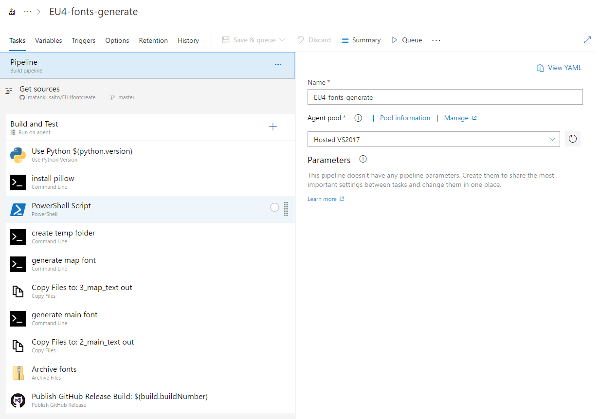
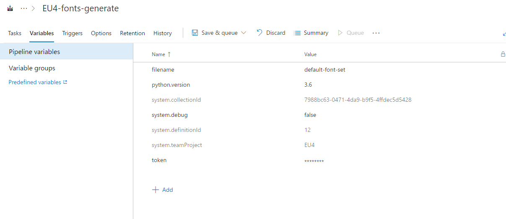

# EU4fontcreate

## Overview
 - Steam配信されているWindows版Europa Universalis IVの日本語化パッチの副産物です。パッチはこのプログラムを使って作成されたフォントのみを受け付けます。
 - CP1252の0x80から0x9Fまでに相当する文字（例えば€）はUCS2のコードポイントではなくて、CP1252のコードポイントとして作成されます。
 - 0x100から0x1FFまでの文字は私用領域(0xE000)にシフトされたコードポイントになります。例えばλは3BBではなくて、0xE3BBのコードポイントになります。
 - 0xE,0xFのコードポイントにはそれぞれ、日付用に"日"と"年"が割り振られます。

## create on local

### Requirement
 - Windows10 or later
 - python 3.5 or later
 - pillow ```pip install pillow```

### Usage
 同梱しているbmfont64.exeを使用して、作成したいフォントのconfigurationファイル（.bmfc）をbmfcフォルダに保存してください。この時、含める文字は空にしてください。含めたい文字はsourceフォルダに任意の名前のBOM付きのUTF-8のtxtファイルに入れておきます。こちらで予めCP1252の追加文字と大体のSHIFT_JISの範囲の文字を入れたテキストを用意していますので、これ以外で必要な文字をtxtとして追加してください。

マップフォントを作る場合はhieroフォルダにあるREADMEを参照してください。

 準備が整ったら、generate.pyを実行します。outフォルダに生成されたフォントが入ります。

マップ用のフォントは上記とは別の方法で作られています。詳細はhieroフォルダにあるmemo.mdを参照してください。

## create on cloud
フォント生成を自動化しましょう。

### GitHub

1. GitHubのアカウントを作ってください。
1. このレポジトリをForkしてください。以下そのForkしてきたレポジトリに対して処理してください。
1. 1_tool/fontに生成に必要なフォントファイルを入れてください。
1. 2_main_text/bmfcにbmfontの設定ファイルを入れてください。このとき文字は１つも含めないでください。
1. 2_main_text/sourceにUTF8-BOMで含めたい文字を入れたテキストを置いてください。拡張子はtxtにしてください。
1. 3_map_textについても同様にしてください。
1. 以上の変更をレポジトリのmasterにpushしておいてください。

### Azure Devopsの準備

1. [Azure DevOps](https://azure.microsoft.com/ja-jp/services/devops/?&OCID=AID736753_SEM_kIccgsOt)の画面を開きます
1. 無料で始めるをクリックしてください。Microsoftのアカウント作成が必要です。
1. organizationsを１つ作ってください。名前は何でも良いです。
1. Projectを１つ作ってください。名前は何でも良いです。
1. 作成したProjectを開いてPipelinesを開いてください。
1. Pipelineを１つ作成してください。名前は何でも良いです。
1. Select a sourceでGitHubを選び、上の方でGitHubにForkしたレポジトリを選んでください。この時、OAuth2の連携が必要になります。 
1. Select a templateはEmptyほげほげリンクを選んでスキップしてください。

### Pipelineの設定
Pipelineを作ります。この画面は最終的な完成品です。

ymlを載せますので頑張ってそれっぽく作ってください。
```yml
resources:
- repo: self
  lfs: true
queue:
  name: Hosted VS2017
#Your build pipeline references the ‘token’ variable, which you’ve selected to be settable at queue time. Create or edit the build pipeline for this YAML file, define the variable on the Variables tab, and then select the option to make it settable at queue time. See https://go.microsoft.com/fwlink/?linkid=865971
variables:
  python.version: '3.6'
steps:
- task: UsePythonVersion@0
  displayName: 'Use Python $(python.version)'
  inputs:
    versionSpec: '$(python.version)'


- script: 'python -m pip install pillow'
  displayName: 'install pillow'

- powershell: |
   cd 1_tool
   $targetFolder = './fonts';
   
   $itemList = Get-ChildItem $targetFolder;
   foreach($item in $itemList)
   {
       if($item.PSIsContainer)
       {
           Write-Host ($item.Name + 'is folder'); 
       }
       else
       {
           powershell ./Add-Font.ps1 -ExecutionPolicy unrestricted ./fonts/($item.Name)
       }
   } 
   
   add-type -AssemblyName system.drawing
   (New-Object System.Drawing.Text.InstalledFontCollection).Families
  displayName: 'PowerShell Script'

- script: 'mkdir fonts'
  displayName: 'create temp folder'

- script: |
   cd 3_map_text
   mkdir out
   python generate.py
   cd out
   dir
  displayName: 'generate map font'

- task: CopyFiles@2
  displayName: 'Copy Files to: 3_map_text out'
  inputs:
    SourceFolder: '3_map_text/out'

    Contents: |
     *.dds
     *.fnt
     *.tga

    TargetFolder: fonts


- script: |
   cd 2_main_text
   mkdir out
   python generate.py
   cd out
   dir
  displayName: 'generate main font'

- task: CopyFiles@2
  displayName: 'Copy Files to: 2_main_text out'
  inputs:
    SourceFolder: '2_main_text/out'

    Contents: |
     *.dds
     *.fnt
     *.tga

    TargetFolder: fonts


- task: ArchiveFiles@2
  displayName: 'Archive fonts'
  inputs:
    rootFolderOrFile: fonts

    archiveFile: '$(Build.ArtifactStagingDirectory)/$(filename).zip'


- task: jakobehn.jakobehn-vsts-github-tasks.publish-github-release.PublishGitHubRelease@0
  displayName: 'Publish GitHub Release Build: $(build.buildNumber)'
  inputs:
    applicationName: 'font-test'

    token: '$(token)'

    repo: EU4fontcreate

    owner: 'matanki-saito'

    tagName: 'Build-$(build.buildNumber)'

    releaseName: 'Build: $(build.buildNumber)'

    assetsPattern: '$(Build.ArtifactStagingDirectory)/$(filename).zip'
```

下記よく確認してください。

 - git LFSを有効にするチェックが入っているか
 - HostはVS2017か

### 変数とクレデンシャルの設定
ファイル名やGitHubに成果物を送信するときのアクセスキーなどを登録します。Taskタブの右にVariablesがあるので、ここで下記のように設定してください。



 - filename: zipのファイル名
 - python.version: pythonのバージョン
 - token: GitHubのアクセストークン（ここで作ってください：https://github.com/settings/tokens）

### 実行
Pipelineをキューに入れて実行を待ちます。処理がうまくいくと、Githubのアセットに生成されたファイルが飛んできます。

### トリガー
処理のトリガーはmasterの修正などにすると良いと思います。

## Licence
 - generate.py : MIT license
 - bmfont64.exe : zlib license
 - [源ノ明朝](https://github.com/adobe-fonts/source-han-serif) : SIL Open Font License 1.1
 - [源ノ角ゴシック](https://github.com/adobe-fonts/source-han-sans) : SIL Open Font License 1.1
 - nvcompress: MIT license
 - Add-Font.ps1 : free
 - runnable-hiero.jar: ?