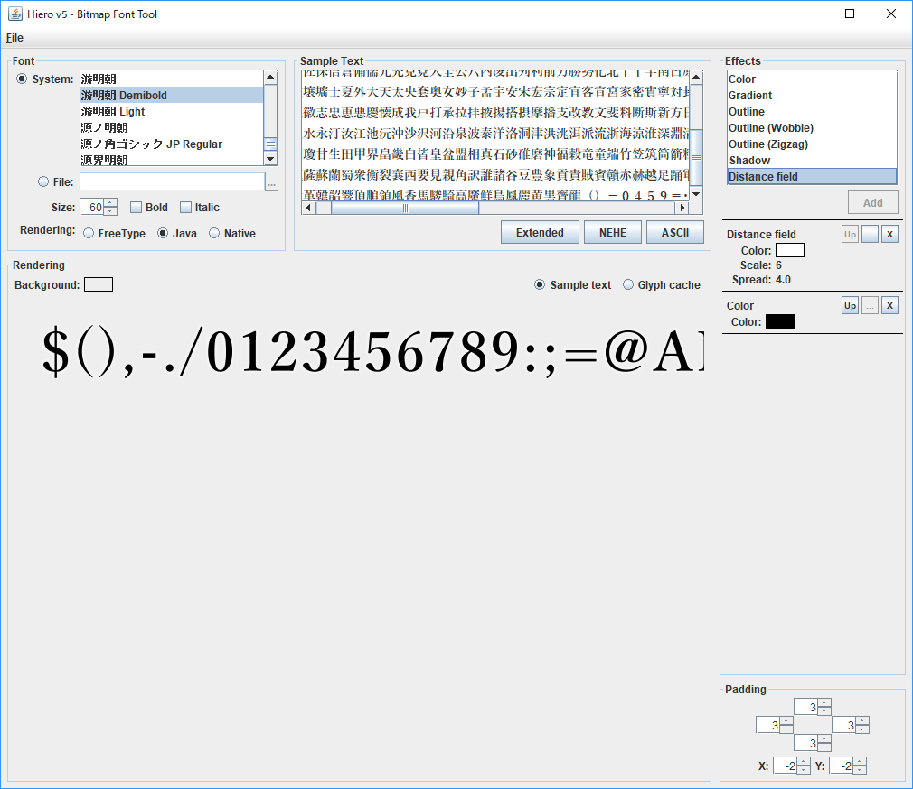
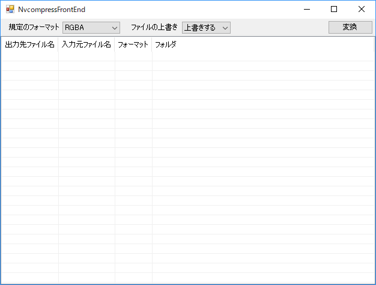

# Map用フォント

## 準備
 - Javaが起動する環境。JREをインストールすればOK。
 - この[リンク](https://drive.google.com/open?id=112maCnY2MLkfTnikqCP93bjzoSz7wiDM)からrunnable-hiero.jarをダウンロードしておく。
 - この[リンク](http://ch.nicovideo.jp/sevrunear/blomaga/ar539518)からNvcompressFrontEndをダウンロードしてzip解凍しておく。

## フォントfntとテクスチャpng画像の生成
runnable-hiero.jarをダブルクリックして、起動したHieroからYuMincho60bold.hieroを読み込む。

メニュー＞File＞Save BMFontで、ファイルを書き出す用に指示。時間はかかるが指定した場所にfntファイルとpngファイルが出来上がるのを待つ。

## テクスチャpng画像をddsに変換する
NvcompressFrontEndを起動して、規定のフォーマットをRGBAにする。

pngファイルをD&Dして、変換ボタンを押す。一瞬でddsに変換される。

